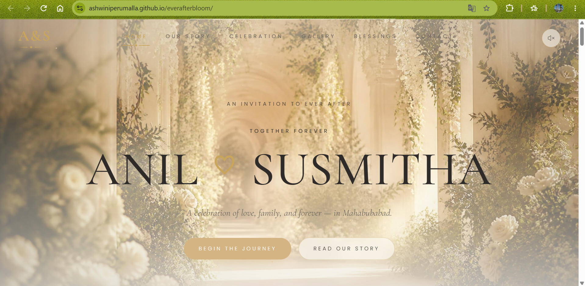

# Ever After Bloom

### Luxury Interactive Wedding Invitation Website

Ever After Bloom is a premium, responsive digital wedding invitation designed for **Anil & Susmitha**.

The project transforms a traditional wedding invitation into an immersive digital experience, combining editorial-style design, storytelling, elegant animations, responsive layouts, and interactive elements.

The goal was to create a website that feels like a **digital keepsake rather than a traditional invitation template**.

---

## ✨ Live Demo

**Live Website:**  
https://ashwiniperumalla.github.io/everafterbloom/

**Lovable Deployment:**  
https://everafterbloom.lovable.app

---
## 📸 Preview



## 📌 Project Overview

**Project Name:** Ever After Bloom  
**Type:** Interactive Wedding Invitation Website  
**Design Style:** Luxury Editorial Botanical  
**Location:** Mahabubabad, Telangana, India  
**Status:** Completed & Deployed

The website was designed with a warm, elegant visual language inspired by luxury editorial design and fine-art wedding photography.

---

## 🎨 Design Concept

The visual direction combines:

- Luxury editorial aesthetics
- Botanical elements
- Warm ivory and champagne tones
- Elegant typography
- Minimal fine-art styling
- Cinematic transitions
- Soft animations
- Generous whitespace

### Color Palette

- Soft Cream
- Champagne Gold
- Muted Sage
- Deep Charcoal
- Warm Gray
- Soft Gold

The design intentionally avoids harsh black, bright white, and excessive visual effects.

---

## 🚀 Features

### Opening Experience

- Cinematic opening animation
- Interactive invitation reveal
- Gold wax-seal interaction
- Smooth transition into the main website
- Automatic reveal for visitors who do not interact

### Hero Section

- Full-screen editorial presentation
- Couple names with elegant typography
- Wedding invitation messaging
- Location information
- Interactive call-to-action buttons

### Our Story

A dedicated storytelling section describing the couple's journey from meeting to marriage.

### Celebration

Dedicated sections for:

- Marriage Registration
- Groom's Reception
- Bride's Reception

Wedding details are designed to be easily updated as final information becomes available.

### Gallery

- Responsive gallery layout
- Editorial-style image presentation
- Elegant placeholders for future wedding photographs

### Blessings

A dedicated section for wedding wishes and blessings.

### Contact

A simple section for invitation/contact information.

### Music

- Interactive music control
- Background wedding music
- User-controlled playback

### Responsive Design

Optimized for:

- Desktop
- Laptop
- Tablet
- Mobile

---
## ✨ Key Highlights

- Cinematic wedding invitation opening experience
- Interactive gold wax-seal invitation reveal
- Smooth Framer Motion animations and transitions
- Editorial-style responsive wedding layout
- Reusable React and TypeScript components
- Responsive navigation for desktop, tablet, and mobile
- Interactive background music control
- Elegant botanical and luxury editorial visual system
- GitHub Actions CI/CD deployment
- GitHub Pages hosting
  
## 🛠️ Tech Stack

- React
- TypeScript
- TanStack Start
- Vite
- Tailwind CSS
- Framer Motion
- Lucide Icons
- GitHub Actions
- GitHub Pages

---

## 🧩 Project Structure

```text
everafterbloom/
│
├── .github/
│   └── workflows/
│       └── deploy.yml
│
├── public/
│   └── static assets
│
├── src/
│   ├── components/
│   ├── routes/
│   ├── styles/
│   └── server.ts
│
├── package.json
├── vite.config.ts
├── tsconfig.json
└── README.md

## ⚙️ Running the Project Locally

### 1. Clone the repository

```bash
git clone https://github.com/ashwiniperumalla/everafterbloom.git
```
### 2. Open the project
``` bash
cd everafterbloom
```
### 3. Install dependencies
``` bash
npm install
```
### 4. Start the development server
``` bash
npm run dev
```
